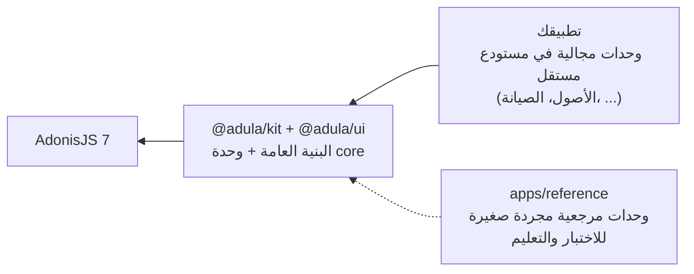
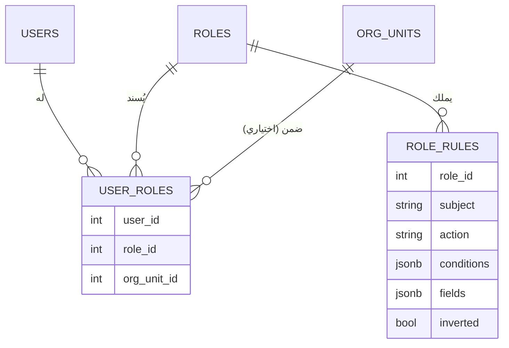
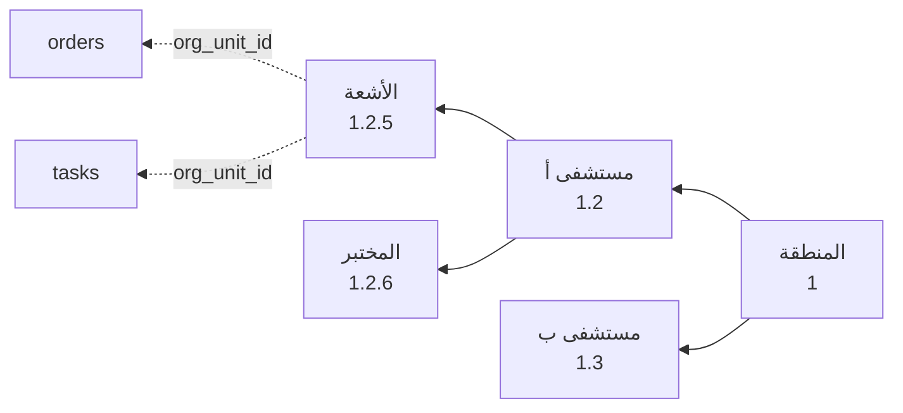
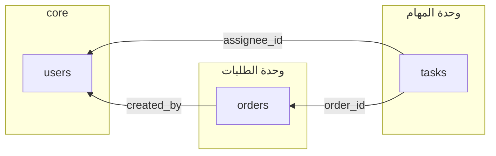
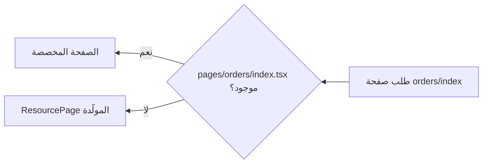
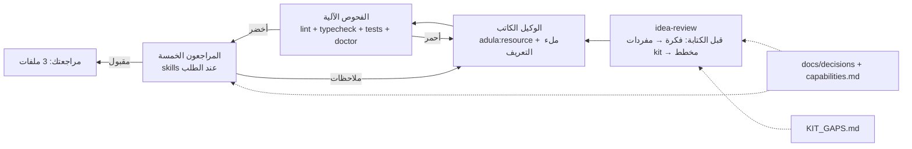
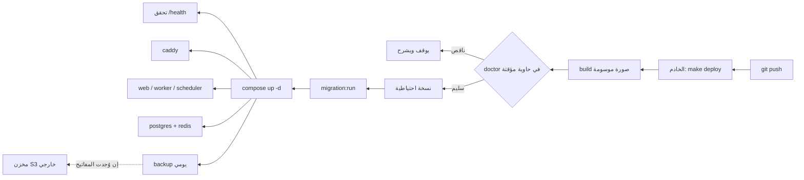
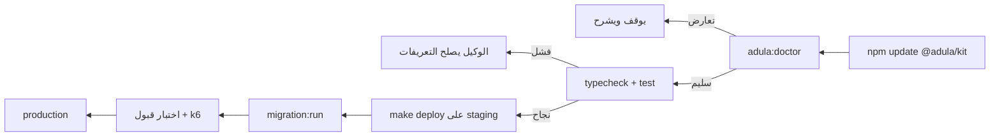
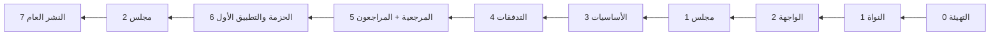

<div dir="rtl">

# adula-kit — إطار تطبيقات الأعمال فوق AdonisJS 7

> **المبدأ الحاكم: الإضافة مجرد كود لم يُكتب بعد.**
> ما يُبنى مسبقاً هو فقط ما يجعل كتابة الكود اللاحق آمنة: نقاط الامتداد، والكيان المرجعي، والفحوص الآلية، وأمر التوليد.

**الإصدار:** 4 (بعد جولتي المجلس ومراجعة خارجية بمرورين). **الترخيص:** MIT من السطر الأول. **النطاق:** `@adula` على npm (لا حزمة تحته حتى تاريخه؛ يُنشأ كمنظمة عند التسجيل، والبديل `@adula-kit`).

---

## 1. ما هو adula-kit

**طبقة تطبيقات أعمال عامة فوق AdonisJS 7.** لا منطق مجال فيها: لا موردون ولا أصول ولا صيانة. تعطي ما يحتاجه أي نظام عمل ليُبنى فوقها بوكيل AI: تعريف كيان يولّد كل شيء، وتخويلاً موحداً بنطاق تنظيمي، وواجهة مولَّدة، ودورة حياة مستند وتدفقات، وأحداثاً بين الوحدات، ونشراً بأمر واحد، وتحديثات آمنة للمشاريع القائمة.



**مصطلح:** "كيان" في هذا الملف تعني resource (جدول + نموذج + محوّل + صفحات + اختبار)، أما "مورد/موردون" فتعني supplier فقط.

ثلاث طبقات لا تختلط: الإطار الأساسي، ثم kit، ثم التطبيق. الوحدات المرجعية داخل kit تعليمية ومجردة (`orders`, `tasks`) وتُحذف بأمر؛ التطبيقات الحقيقية تعيش خارجها وتستهلكها كحزمة.

**معيار الإنجاز الثابت:** جملة واحدة للوكيل تنتج كياناً كاملاً (جدول، صلاحيات، صفحات، اختبار) خلال دقائق، ومراجعتك عشر دقائق. **معيار الاكتمال 1.0:** كل بند في القسم 14 مبني ومستهلك بوحدة مرجعية واختبار أخضر. ما بعده إصدارات 1.x بمبرر من مشروع حقيقي.

---

## 2. القرارات المحسومة (لا تُعاد مناقشتها)

| القرار | الاختيار | السبب المختصر |
|---|---|---|
| الإطار | AdonisJS 7 | قرارات محسومة + أنواع من المسار إلى المكوّن = أقل مساحة لخطأ الوكيل |
| الواجهة | @adonisjs/inertia 5.x (نواة Inertia 3.x كما تعلنها peerDependencies) + React 19 | واجهة كاملة الحرية بلا API منفصل |
| قاعدة البيانات | PostgreSQL 17 + Lucid، ltree للشجرة | |
| التخويل | **CASL مقيّماً وحيداً** + جداول kit الخاصة (roles, role_rules, user_roles) | مفردات واحدة من القاعدة إلى SQL إلى الواجهة؛ لا حزمة مجتمعية في أخطر طبقة |
| الهيكل التنظيمي | org_units شجري بـ ltree + org_unit_id في كل كيان scoped | النطاق قيد بنيوي يُجمع بـ AND خارج CASL |
| المستأجر | **نشر واحد لكل جهة** (قاعدة ومستودع .env مستقلان). الشجرة هيكل تنظيمي لا حدود ملكية. `scoped: false` = مركزي داخل النشر. لا tenant_id | حدود الملكية لا تُربط بهيكل إداري متغيّر؛ SaaS متعدد المستأجرين في قاعدة واحدة خارج 1.0 ويُعامل كإصدار رئيسي |
| المعمارية | Modular Monolith | الوحدات تتشارك الجداول ولا تكررها، وتتواصل بالأحداث |
| التوزيع | **هجين:** الخلفية حزمة npm `@adula/kit`؛ الواجهة سجل shadcn خاص `@adula/ui` يُنسخ | الحزمة تُحدَّث بأمر؛ المكونات يملكها المشروع بلا تبعية مقلوبة |
| المستودع | monorepo بـ pnpm workspaces من اليوم الأول | البناء كحزمة بعد الكود إعادة كتابة |
| الوظائف والجدولة | @nemoventures/adonis-jobs + adonisjs-scheduler خلف واجهة `jobs` في kit | قابلة للاستبدال دون مس الوحدات |
| المصادقة | القالب الرسمي + Ally؛ 2FA بـ otpauth | لا خدمات خارجية |
| المرفقات | @jrmc/adonis-attachment + Drive؛ `DRIVE_DISK=local` افتراضياً للمشاريع الصغيرة، `s3` بمتغير واحد؛ المسارات نسبية في القاعدة؛ `adula:storage:migrate` للنقل | الملفات تدخل النسخ الاحتياطي دائماً |
| النشر | مصدر واحد (المستودع) وأمر واحد (`make deploy`) بـ docker compose، بتسلسل: بناء ← فحص ونسخة ← ترحيل ← تشغيل ← تحقق | لا منصة نشر؛ تعدد الجهات = تعدد النشرات (يدوي، وهو ما قد يعيد منصة نشر لاحقاً بلا تغيير في kit) |
| اللغة | ما يقرؤه الوكيل بالإنجليزية، وما يقرؤه المستخدم بالعربية | فجوة أداء موثقة 5–15% لغير الإنجليزية |
| الحقول الديناميكية | **ليست في kit.** حقل جديد = ترحيل إضافي بجملة للوكيل | تتعارض مع أساس kit (مخطط يفحصه المجمّع) |
| الحفظ والأحداث | معاملة واحدة للكيان وبنوده وسجل النشاط وصف outbox؛ ناشر في worker بـ `FOR UPDATE SKIP LOCKED`؛ مستمعون متكررو التنفيذ بأمان عبر processed_events | لا حدث يُفقد بعد الحفظ ولا يُنفَّذ مرتين |

**مرفوض نهائياً:** NestJS، Laravel، AdonisJS Plus، Supabase/Clerk، منشئ واجهات بلاكود، محرر تدفقات مرئي، نظام إضافات وقت التشغيل، شاشة حقول ديناميكية، @holoyan/adonisjs-permissions في النواة.

---

## 3. الحزم المعتمدة

متحقق منها من سجل npm بتاريخ 2026-09-17 (الإصدار، تاريخ النشر، إعلان core ^7):

| الحزمة | الإصدار | الدور | ملاحظة |
|---|---|---|---|
| @nemoventures/adonis-jobs | 2.2.0 | طوابير BullMQ | خلف واجهة kit |
| adonisjs-scheduler | 2.8.0 | جدولة | نسخة واحدة في الإنتاج |
| @jrmc/adonis-attachment | 5.2.1 | مرفقات | |
| @jrmc/adonis-mcp | 2.0.0 | كشف التطبيق للوكيل | |
| @adonisjs/inertia | 5.0.1 | المحوّل | يشترط @inertiajs/core و@inertiajs/react ^3.4 (الحالي 3.7.1) |

**مكتبات عامة لا تعتمد على الإطار:** @casl/ability 7.0.1 و@casl/react (المقيّم)، @ucast/sql 0.2.0 (غير مستقر؛ تجربة اليوم الأول تقرر، والمترجم الخاص للعمليات الست هو الأرجح)، XState 5.33 (المرحلة 4)، otpauth، TanStack Table وVirtual، react-hook-form، Zod، exceljs، papaparse، k6 للقياس.

**مرفوضة:** @rlanz/bull-queue و@nulix/adonis-2fa وadonis-captcha-guard (لا تدعم 7)؛ @holoyan/adonisjs-permissions و-activitylog (تدعم 7 لكن kit يملك جداول التخويل والنشاط بنفسه).

**قاعدة الاعتماد:** قبل أي حزمة: `npm view <package> version time.modified peerDependencies`. ثلاثة شروط: تعلن core ^7، آخر نشر خلال ستة أشهر، لها اختبارات. **في المشاريع:** تثبيت دقيق للإصدار (لا `^`) لحزم kit، وprovenance عند النشر.

---

## 4. بنية المستودع

```text
adula/                          # monorepo (pnpm workspaces), MIT
  packages/
    kit/                        # @adula/kit — الخلفية كحزمة AdonisJS
      src/
        resource/               # defineResource, registry, types
        admin/                  # المتحكم العام (Inertia + JSON) والمحوّل
        auth/                   # CASL ability builder, accessibleBy, cache
        org/                    # org_units, ltree helpers
        events/                 # الأحداث المجالية التلقائية
        services/               # notify, sequence, settings, lookups, jobs, pdf
        commands/               # adula:install/resource/module/doctor/seed/gaps/capabilities
      database/migrations/      # ترحيلات kit، بادئة kit_، إضافية فقط
      agent/                    # AGENTS.template.md, skills/, capabilities.md (مولَّد)
      stubs/                    # قوالب adula:resource
      tests/                    # محرك التخويل، مسح المسارات، الأوامر
      providers/kit_provider.ts
    ui/                         # @adula/ui — سجل shadcn خاص
      registry/                 # data-table, resource-form, resource-page, can, shell, ...
  apps/
    reference/                  # التطبيق المرجعي: يستهلك kit كـ workspace:*
      app/modules/
        core/                   # (من kit) users, roles, org, settings, notifications, activities
        orders/                 # وحدة مرجعية: submittable + تدفق + بنود
        tasks/                  # وحدة مرجعية: scoped + أحداث تعتمد على orders
      inertia/components/ui/    # shadcn + @adula/ui منسوخة
      AGENTS.md  CLAUDE.md  KIT_GAPS.md
      deploy/  docker-compose.prod.yml  Makefile
  docs/
    decisions/                  # ADR: قرار في ملف، كامل هنا ومختصر في الحزمة
  .github/workflows/ci.yml
  LICENSE (MIT)
```

**بنية الوحدة داخل أي تطبيق:**

```text
app/modules/<name>/
  module.ts        # الاسم، الموارد، الاعتماد، القائمة
  models/  resources/  validators/  migrations/  factories/
  listeners/       # اشتراكات في أحداث وحدات أخرى
  jobs/  workflows/  reports/
  pages/           # تجاوزات اختيارية للصفحات المولَّدة
  tests/
```

**ملكية الملفات (أساس التحديث الآمن):**

| تملكه الحزمة (يُحدَّث بـ npm) | يملكه المشروع (لا تلمسه الحزمة) |
|---|---|
| كل ما في packages/kit وترحيلاته | تعريفات الكيانات والوحدات وترحيلاتها |
| قوالب الرسائل الافتراضية | تعديلاتها (في جدول لا ملف) |
| الجزء المُدار من AGENTS.md والمهارات | ما بعد العلامة في AGENTS.md |
| — | مكونات ui المنسوخة والصفحات المتجاوزة |

---

## 5. تعريف الكيان (قلب الإطار)

ملف TypeScript واحد لكل كيان؛ منه يُولَّد كل شيء والمجمّع يتحقق منه. الكيان المرجعي في `apps/reference/app/modules/orders/resources/order.ts` يحوي **كل** نوع حقل وكل خاصية مرة واحدة؛ ما لا يراه الوكيل في المثال يخترعه.

```typescript
// app/modules/orders/resources/order.ts
import { defineResource } from '@adula/kit'
import Order from '#modules/orders/models/order'
import { orderValidator } from '#modules/orders/validators/order'

export default defineResource({
  name: 'orders',
  label: { ar: 'الطلبات', en: 'Orders' },
  model: Order,
  validator: orderValidator,

  scoped: true,          // إلزامي: true = org_unit_id + نطاق الشجرة تلقائياً
  submittable: true,     // doc_status + amended_from_id + حدث submitted
  // اختيارية بقيم افتراضية: version (true إن submittable)، search (true إن وُجد searchable)، customFields (false)

  fields: {
    number:     { type: 'string',    label: { ar: 'رقم الطلب', en: 'Number' }, sequence: 'ORD', unique: true },
    customerId: { type: 'belongsTo', resource: 'customers', label: { ar: 'العميل', en: 'Customer' } },
    total:      { type: 'money',     label: { ar: 'الإجمالي', en: 'Total' }, sortable: true, permissionLevel: 1 },
    status:     { type: 'lookup',    group: 'order_status', label: { ar: 'الحالة', en: 'Status' }, filterable: true },
    notes:      { type: 'text',      label: { ar: 'ملاحظات', en: 'Notes' }, searchable: true },
    issuedAt:   { type: 'date',      label: { ar: 'تاريخ الإصدار', en: 'Issued at' }, sortable: true },
    lines:      { type: 'hasMany',   resource: 'order_lines', inline: true, label: { ar: 'البنود', en: 'Lines' } },
    contract:   { type: 'attachment', label: { ar: 'العقد', en: 'Contract' } },
    internalNote: { type: 'text',    label: { ar: 'ملاحظة داخلية', en: 'Internal note' } },
  },

  list: ['number', 'customerId', 'total', 'status', 'issuedAt'],
  form: ['number', 'customerId', 'status', 'issuedAt', 'lines', 'notes', 'contract', 'internalNote'],
  show: ['number', 'customerId', 'total', 'status', 'issuedAt', 'lines', 'notes', 'contract', 'internalNote'],

  actions: ['view', 'create', 'update', 'delete', 'submit', 'cancel'],

  // العقود الثلاثة (تفصيلها بعد المثال):
  //   select    تلقائي، لا يُكتب: الأعمدة القياسية والمفاتيح وما تعتمد عليه شروط الصلاحيات
  //   form      ما يُكتب من الواجهة
  //   serialize ما يُرسل: افتراضه list ∪ show + version + docStatus؛ hidden يستثني منه
  hidden: ['internalNote'],           // لا يخرج للواجهة إلا لمستوى صلاحية 1

  hooks: {
    beforeSave: async (order, ctx) => { /* نقطة امتداد معلنة */ },
  },
})
```

**الأعمدة القياسية (يولّدها الأمر ولا تُكتب يدوياً):**

- إلزامية (7): `id`, `org_unit_id` (إن scoped), `created_by`, `updated_by`, `created_at`, `updated_at`, `deleted_at`.
- اختيارية بافتراضات: `version` (تلقائي للـ submittable؛ 409 عند التعارض)، `search_vector` (tsvector + GIN فقط إن وُجد حقل searchable)، `custom_fields` (JSONB عند `customFields: true` فقط)، `doc_status` و`amended_from_id` (للـ submittable).
- الفهارس المولَّدة: كل مفتاح أجنبي، `(org_unit_id, deleted_at)` مركّب، تفرد جزئي `where deleted_at is null`، GiST على path، GIN على search_vector.
- سياسة المفاتيح الأجنبية: `restrict` افتراضياً؛ `cascade` داخل الوحدة نفسها فقط.

**العقود الثلاثة للحقول (ليست متطابقة، والخلط بينها ثغرة):**

| العقد | ما يضمه | من يحدده |
|---|---|---|
| `select` (داخلي) | الأعمدة القياسية، المفاتيح الأجنبية، `version`، وكل عمود تشير إليه شروط `role_rules` (تُستخرج مفاتيح conditions عند بناء Ability) | kit تلقائياً؛ لا يُكتب |
| `form` (قابل للكتابة) | ما يقبله المتحكم من الواجهة؛ ما عداه يُرفض حتى لو أُرسل | التعريف |
| `serialize` (يُرسل) | افتراضه `list ∪ show` + `version` (حقل مخفي في ResourceForm وإلا فالقفل التفاؤلي لا يعمل) + `docStatus`؛ `hidden` يستثني، و`permissionLevel` يحجب حسب المستخدم | التعريف عند الحاجة |

**اختبار العقد لكل كيان:** أنواع Tuyau للطلب والاستجابة تطابق التعريف (ما في form يُقبل، ما في hidden لا يخرج، select لا يظهر). TypeScript وحده لا يثبته.

**قواعد التعريف:** TypeScript لا JSON؛ label بالعربية والإنجليزية؛ scoped إلزامي؛ نقاط الامتداد المعلنة فقط: hooks، تجاوز الصفحة بملف، الأحداث، المستمعون.

---

## 6. التخويل: مقيّم واحد

**القرار:** CASL يقيّم كل شيء؛ الجداول جداول kit. لا حزمة مجتمعية في هذه الطبقة لأن ترحيلاتها تُشحن إلى كل مشروع لسنوات.



- `role_rules` هو شكل قاعدة CASL الخام حرفياً: لا تحويل. لا جدول permissions؛ الأزواج (كيان × إجراء) تُشتق من سجل الكيانات.
- `user_roles.org_unit_id` اختياري: "مدير في قسم الأشعة" دور مقيّد بوحدة.
- **المنع:** CASL تفحص القواعد بأولوية آخرها، فالمنع لا يتقدم تلقائياً. Ability builder يضيف كل قواعد السماح أولاً ثم كل قواعد `inverted` أخيراً، دائماً وبلا استثناء، ويثبته اختبار.
- **نطاق الشجرة قيد بنيوي خارج CASL يُجمع بـ AND:** في SQL شرط `org_units.path <@ user_paths` يُضاف دائماً لكل كيان scoped (ltree بفهرس GiST)، وفي الذاكرة فحص `inOrgScope(record, user)` قبل `ability.can`. لا يُمثَّل كقاعدة سماح لأن قواعد CASL تُجمع بـ OR فتوسّع الوصول.
- **الترجمة إلى SQL:** `accessibleBy(query, ability, action)` فوق `knexQuery` في Lucid؛ @ucast/sql (0.2.0) تُجرَّب معزولة في اليوم الأول، والمترجم الخاص للعمليات الست (eq, ne, in, lt, gt, like) هو الأرجح. **أي شرط غير مدعوم يُرفض بخطأ صريح، لا يُتجاهل.**
- **الحقول:** `permittedFieldsOf` يغذي serialize؛ `permissionLevel` في التعريف يصير قاعدة fields.
- **الواجهة:** `packRules` لقواعد الكيان الحالي فقط، ومكوّن `Can`.
- **التخزين المؤقت:** Ability لكل مستخدم في @adonisjs/cache مع إبطال عند تغيّر دور أو شجرة؛ الوحدات التابعة بـ ltree تُحسب مرة. يُبنى في المرحلة 1 لأن المتحكم يُكتب حوله.

**الطبقات في المتحكم العام، بترتيب ثابت:** auth (من أنت) → نطاق الشجرة (قيد AND) → Ability (هل تستطيع، بأي شروط، أي حقول) → التنفيذ.

**الشاشة:** مصفوفة أدوار × كيانات × إجراءات تكتب صفوف role_rules؛ محرر شروط بسيط لإضافة conditions/fields على قاعدة. تُبنى مرة من السجل ولا تُعدَّل عند إضافة كيان.

**اختبارات لا تُدمج التغييرات بدونها:**

1. **مجموعة محرك التخويل** (تُكتب بيدك، في CI الحزمة، معيارها تغطية الدلالات لا العدد): المنع بعد السماح وقبله، تعدد الأدوار، `NULL` في الشروط، الحقول، العلاقات، الدور المقيّد بوحدة، نقل الوحدات، المستخدم بلا أدوار، تطابق SQL مع التقييم في الذاكرة، رفض الشرط غير المدعوم.
2. **مسح المسارات** (مستقل عن القالب): يجمع كل المسارات المسجلة ويطلبها بمستخدم بلا صلاحية ويتوقع 403، وبمستخدم خارج النطاق ويتوقع 404.
3. **اختبار 403/404 المولَّد** مع كل كيان (من القالب).

---

## 7. الهيكل التنظيمي

جدول واحد `org_units` لكل المستويات: `id, parent_id, name, type, path (ltree)`. إضافة مستوى أعلى = صف جديد وتعديل parent_id؛ لا يتغير أي جدول عمل.



**قرارات:** المستخدم يتبع عدة وحدات (`user_org_units`)؛ الكيانات المركزية `scoped: false`؛ نقل سجل = تغيير org_unit_id + سطر نشاط؛ نقل وحدة = تحديث path لما تحتها في معاملة (والنطاق يتبع path الجديد فوراً)؛ الشجرة هيكل تنظيمي لا حدود ملكية: نشر واحد لكل جهة، ولا tenant_id.

---

## 8. الوحدات: Modular Monolith

| الكلمة | المعنى |
|---|---|
| النظام | التطبيق كله: قاعدة واحدة، دخول واحد، لوحة واحدة |
| الوحدة | مجلد بمنطقه وشاشاته وترحيلاته |
| الكيان | كيان واحد داخل الوحدة |
| التطبيق | كلمة تُتجنَّب؛ توحي بفصل قاعدة ومستخدمين غير موجود |



**القواعد:** الوحدة تملك جداولها وحدها؛ الإشارة بـ belongsTo لا بالنسخ؛ اتجاه الاعتماد واحد كما في `start/modules.ts`؛ الحقل الإضافي على كيان غيرك يُطلب من وحدته أو يُحفظ عندك؛ الوحدات تتواصل بالأحداث لا باستيراد المتحكمات؛ الوحدة بلا اعتماد تنتقل وحدها. **قبل إنشاء كيان:** فحص السجل؛ إن وُجد كيان بالمعنى نفسه فاربط به. لا جداول مكررة.

**ينفصل شيء إلى نظام مستقل** فقط لعملاء لا يتشاركون بيانات أو لجزء بإيقاع نشر وحمل مختلف جداً.

---

## 9. الواجهة

### الترتيب: صفحة مرجعية قبل المولّد

قبل كتابة سطر في ResourcePage: صفحة قائمة وصفحة نموذج مصممتان بيدك بالبيانات العربية الحقيقية (أسماء طويلة، أرقام، تواريخ)، ونظام tokens للكثافة والمسافات والألوان. هما المرجع البصري للمولّد. RTL يُختبر بالعين في وقت محجوز.

### التوزيع الهجين

- **@adula/ui سجل shadcn خاص:** `node ace adula:ui add data-table` يغلّف `shadcn add` وينسخ المكوّن إلى المشروع ويسجله في `ui.lock.json` (الاسم، الإصدار، hash). التحديث بإعادة الأمر ومقارنة الفرق؛ doctor يقرأ مصفوفة توافق المكونات مع إصدار الحزمة. لا تبعية مقلوبة ولا فحص Tailwind لـ node_modules.
- **المجموعة الثابتة (تُنسخ في adula:install):** button, input, textarea, select, checkbox, switch, radio-group, table, form, label, dialog, sheet, dropdown-menu, popover, command, calendar, badge, card, tabs, sonner, skeleton, pagination, tooltip, separator, alert — مراجَعة RTL في kit.
- **مكونات kit:** shell (القائمة الجانبية من السجل)، DataTable، ResourceForm، ResourceShow، ResourcePage، Can، backup-banner.
- **قاعدة الوحدات:** يُمنع `shadcn add` داخل وحدة؛ المكوّن الناقص يُضاف إلى @adula/ui بعد مراجعة الاتجاه.

### المولَّد

- `index`: DataTable بفرز وتصفية وبحث نصي وترقيم keyset عبر `inertia.scroll`، صفوف افتراضية فوق 200 صف، تصدير CSV، عروض محفوظة.
- `show`: بطاقة الحقول، أزرار حسب Ability، أقسام ثقيلة (التعليقات، النشاط) كـ deferred props.
- `create`/`edit`: ResourceForm بكل الأنواع، belongsTo ببحث تلقائي عبر `useHttp`، hasMany inline كجدول قابل للتحرير، `version` كحقل مخفي، أخطاء VineJS عبر `Form` المربوط بالمسار.
- **قاعدة التجاوز:** وجود `pages/<resource>/index.tsx` يستبدل المولَّد. لا إعدادات ولا خطافات.



### الشاشات الثابتة في core

دخول/تسجيل/استعادة/2FA/ملف شخصي؛ المستخدمون (تعطيل، انتحال، وحدات)؛ الأدوار (المصفوفة والشروط)؛ الهيكل التنظيمي (شجرة قابلة للنقل)؛ النشاط؛ الجلسات؛ الوظائف؛ الإعدادات (system/org_unit/user)؛ الإشعارات؛ مهامي؛ شريط تحذير النسخ الاحتياطي.

---

## 10. الأوامر

| الأمر | ما يفعله |
|---|---|
| `adula:install` | جداول core، جذر الشجرة، admin، الأدوار الأساسية، نسخ المجموعة الثابتة وAGENTS.md والمهارات وdeploy/ |
| `adula:resource <name> --module=<m>` | نموذج بالأعمدة القياسية، ترحيل بفهارسه، مدقق، تعريف كيان، مصنع، اختبارات 403/404/تفرد/نطاق، سطر التسجيل |
| `adula:module:add <name>` / `remove` | هيكل وحدة فارغ / حذف وحدة مرجعية |
| `adula:doctor` | قبل كل نشر وترقية: مفاتيح النسخ الخارجي، ترحيلات معلقة، تطابق إصدار kit، آخر نسخة وآخر استعادة، الجزء المُدار في AGENTS.md، توافق ui.lock.json، حجم uploads (تحذير فوق 5GB: حان وقت s3)، علامات الالتفاف القابلة للإنفاذ |
| `adula:ui add <component>` | يغلّف shadcn add ويسجل في ui.lock.json؛ الأمر الوحيد المسموح لنسخ المكونات |
| `adula:storage:migrate local s3` | ينقل الملفات الموجودة عند التبديل |
| `adula:seed --rows=N` | بيانات تجريبية بتوزيع واقعي (وحدات غير متساوية، محذوفات، أدوار متعددة) |
| `adula:capabilities` | يولّد `capabilities.md` من أنواع defineResource ونقاط الامتداد والأوامر |
| `adula:gaps report` | يجمع KIT_GAPS.md ويعرضه ويطلب تأكيداً صريحاً قبل الإرسال بعد إخفاء الأسماء الخاصة |
| `adula:upgrade` | مع الإصدار الرئيسي فقط: codemod لتعريفات الكيانات + UPGRADE.md |
| `backup:verify` | يومياً: نسخة اليوم موجودة في المخزن الخارجي وإلا إشعار admin |

الأوامر تُبنى فوق `BaseCommand` وقوالب stubs وcodemods الرسمية، بلا اختراع.

---

## 11. الوكيل: أربع طبقات تُشحن مع kit

### اللغة

ما يقرؤه الوكيل بالإنجليزية (AGENTS.md، المهارات، أسماء الملفات والجداول والمتغيرات، التعليقات، الالتزامات، الاختبارات)، وما يقرؤه المستخدم بالعربية (label.ar، القوائم، نصوص الواجهة، القوالب). هذا الملف يبقى بالعربية لأنه لك ولا يُعطى للوكيل. جملك اليومية بالعربية مع أسماء الكيانات والحقول بالإنجليزية داخلها.

### الطبقات



**1. idea-review (من المرحلة 1، لا تأجيل):** تُستدعى لوحدة أو تدفق جديد فقط (لا لإضافة حقل). تحوّل الفكرة إلى مفردات kit، تفحصها ضد القرارات، تصنّف كل مطلب: ينفَّذ الآن / بامتداد معلن / **خارج kit**، وتُخرج مخطط الوحدة للموافقة. نسختها الأولى تقرأ docs/decisions وقائمة يدوية قصيرة؛ الكاملة (المرحلة 5) تقرأ capabilities.md المولَّد.

**2. الفحوص الآلية (المرحلة 1):** قواعد ESLint مخصصة (استيراد متحكم من وحدة أخرى، `toJSON` مباشر، تعديل داخل `node_modules/@adula`)، typecheck، الاختبارات المولَّدة ومسح المسارات، adula:doctor، CODEOWNERS على packages/kit، فحص CI يرفض PR من تطبيق يلمس kit. الوكيل يعمل داخل سياج لا وعد.

**3. المراجعون الخمسة (المرحلة 5، عند الطلب لا في كل جلسة):** module-review (اتجاه الاعتماد، الأحداث، scoped)، security-review (authorize، serialize، لا تشفير يدوي، ASVS للحساس)، schema-review (الفهارس، التفرد الجزئي، restrict)، ui-review (لا shadcn add خارج kit، RTL، deferred props)، perf-review (preload، keyset، حد الصفحة، المستمع الثقيل في طابور).

**4. الذاكرة والفجوات:** docs/decisions (ADR كامل في المستودع، مختصر في الحزمة)؛ capabilities.md مولَّد بأمر؛ KIT_GAPS.md في المشروع.

### قاعدة "لا التفاف على قيد" (ضابطان قابلان للإنفاذ آلياً + إرشاد للمراجعين)

إن احتاجت الفكرة ما لا يقدمه kit: ينفَّذ الممكن، ويُسجَّل الباقي في KIT_GAPS.md بصيغة ثابتة (Needed by, Tried, Blocked because, Proposed kit change, Workaround)، ويُبلَّغ المطور صراحة. **الالتفاف مُعرَّف بعلامتين تُفحصان آلياً** (تعديل ملف داخل `node_modules/@adula`، أو patch-package) **وإرشاد يفحصه المراجعون** (إعادة تنفيذ خدمة موجودة في kit باسم آخر؛ لا يُضمن كشفه آلياً). بعد الترقية، doctor يخبر: "GAP-003 صار متاحاً".

### الشحن

| الملف | يعيش في | يصل عبر |
|---|---|---|
| المهارات الست | packages/kit/agent/skills | نسخ مُدار إلى `.claude/skills` عند install وdoctor مع تحقق hash |
| capabilities.md وdecisions المختصرة | الحزمة | تُقرأ من node_modules |
| AGENTS.md | يُنسخ مرة | جزء مُدار بين علامتين يحدّثه doctor + جزء حر للمطور |
| CLAUDE.md | سطران يحيلان إلى AGENTS.md | install |
| KIT_GAPS.md | يُنشأ فارغاً | install |

### AGENTS.md — الجزء المُدار (عشرون قاعدة، بالإنجليزية عمداً)

```markdown
<!-- adula-kit:start (managed by adula:doctor — do not edit) -->
# adula-kit rules
A plugin is just code that has not been written yet. No abstraction before the second need.

Structure
1. One system. Every entity lives in app/modules/<module>. No separate "apps".
2. Reference resource: app/modules/orders/resources/order.ts. Copy its shape exactly.
3. New entity: `node ace adula:resource <name> --module=<module>`, then fill the fields.
4. Before creating an entity, check the registry. Same meaning exists → belongsTo. Never duplicate a table.
5. A module writes only its own tables; dependency direction follows start/modules.ts, never backwards.
6. Modules talk through events, never by importing each other's controllers. Heavy listeners go to jobs.
7. Every resource declares `scoped` explicitly. Standard columns are generated; never edit them. Migrations follow expand/contract: never drop or rename a column in the same release that stops using it.
8. Deletes are soft. Changeable lists come from lookups. Approvable documents use `submittable: true`.
9. Notify via notify(), number via sequence, configure via settings. Nothing else.

Security
10. Every route passes the authorize middleware. Every transformer uses `serialize` (explicit pick).
11. Never write crypto, sessions, or auth flows; use kit. 2FA and impersonation changes need a human review.
12. Never delete or weaken a test to make the build pass.

UI
13. Fill the resource definition before writing a page. Override only via pages/<resource>/.
14. Use only components in inertia/components/ui/. Add components only via `node ace adula:ui add`, never `shadcn add`.
15. RTL by default; Arabic labels; English identifiers.

Boundaries
16. Never modify node_modules/@adula and never use patch-package (enforced by lint). Do not re-implement a kit service under another name (checked in review).
17. A limitation is recorded in KIT_GAPS.md (template inside) and reported to the developer — never worked around.
18. Only packages already in package.json. Ask before adding one.
19. New module or workflow → run the idea-review skill first. Field changes do not need it.
20. Before finishing: `npm run typecheck && npm test && node ace adula:doctor`.
<!-- adula-kit:end -->

## Project rules
(the developer writes here)
```

**اختبار الوكيل الأسبوعي:** جملة قياسية تُعاد كل أسبوع وتُقارن نتيجتها بالمرجع؛ الانحراف مشكلة قواعد لا نموذج.

---

## 12. الاختبارات

| النوع | الأداة | متى |
|---|---|---|
| محرك التخويل (20 حالة) | Japa، في CI الحزمة | شرط دمج أي تغيير في kit/auth |
| مسح المسارات | Japa، مستقل عن القالب | كل PR |
| 403/404/تفرد/نطاق المولَّدة | Japa | مع كل كيان |
| العقد العام للحزمة | api-extractor أو tsd | يكشف الكسر قبل إصدار ثانوي |
| الواجهة | Playwright | الشاشات الثابتة + ResourcePage + RTL بالعين |
| الأداء | k6 على staging ببيانات seed واقعية | نهاية المرحلتين 2 و5، وأسبوعياً |
| التبعيات | npm audit + provenance | كل دفع |
| الوكيل | جملة قياسية أسبوعياً | |

كيان بلا اختبار = كيان يعمل فيه الوكيل أعمى.

---

## 13. الأداء: يُؤسَّس في المتحكم العام

كل طلب يمر عبر ملف واحد؛ أداء النظام كله يُقرَّر فيه مرة.

| الموضع | القرار المؤسِّس |
|---|---|
| N+1 | كل belongsTo في التعريف يُحمَّل بـ preload تلقائياً؛ لا استعلام داخل حلقة |
| الأعمدة | الاستعلام يجلب أعمدة serialize فقط |
| الترقيم | keyset للتمرير، offset للصفحات المرقمة فقط، حد 100 صف، عدّ تقديري فوق 10 آلاف |
| الفهارس | مولَّدة (القسم 5)؛ GiST على path، GIN على search_vector |
| التخويل | Ability مخزنة لكل مستخدم؛ نطاق الشجرة بـ ltree في SQL |
| الكتابة | الكيان وبنوده وسجل النشاط وصف outbox في معاملة واحدة (إدراجات رخيصة)؛ الثقيل عبر outbox → الطابور؛ المستمع متزامن بتصريح فقط |
| Inertia | deferred props للثقيل، once للثابت، قواعد Can للكيان الحالي فقط |
| التخزين المؤقت | lookups والسجل والإعدادات بوسوم في @adonisjs/cache |
| الجدول | صفوف افتراضية فوق 200 |
| المراقبة | otel مع استعلامات القاعدة، pg_stat_statements في compose، سجل الأبطأ من 200ms |

**ميزانية كمعيار قبول** (k6، بيانات seed بـ 100 ألف صف وتوزيع واقعي، 50 مستخدماً متزامناً): قائمة بعلاقتين p95 < 300ms؛ حفظ نموذج < 200ms؛ بناء Ability من الذاكرة المؤقتة < 5ms. **يُترك عمداً:** نسخ القراءة، PgBouncer، CDN، تعدد حاويات web؛ تُضاف بلا تغيير كود حين يطلبها القياس.

---

## 14. أساسيات أنظمة الأعمال: ما يُؤسَّس وما يُبنى مع ميزته

المرجعية: ما ثبت في مخططات Frappe (DocType، naming series، docstatus، permission levels) وOdoo (record rules، chatter، sequences) وDjango Admin. **القاعدة الجديدة بعد اعتماد الحزمة:** الحزمة تشحن ترحيلات إضافية بأمر تحديث، فالجدول يُضاف حين تُبنى ميزته. يُؤسَّس في المرحلة 1 فقط ما يمس الأعمدة القياسية أو المتحكم أو نقاط الامتداد أو له مستهلك في المرحلة 1 نفسها.

### يُؤسَّس في المرحلة 1 (له مستهلك فوري)

| البند | المستهلك |
|---|---|
| roles, role_rules, user_roles | المتحكم العام |
| org_units, user_org_units | النطاق |
| settings (key, value JSON, scope) | doctor، النسخ الاحتياطي، kit version |
| lookups (group, key, label_ar, label_en, sort, active) | نوع الحقل lookup |
| sequences | نوع sequence في الحقل |
| activities (سجل النشاط، داخل المعاملة) | كل كيان |
| outbox + processed_events | الأحداث المجالية: تُكتب في المعاملة، يُنشرها worker بـ SKIP LOCKED، والمستمع يتحقق من processed_events |
| notifications + notify() | backup:verify |
| workflow_runs (فارغ) | حدث submitted يكتب فيه |
| الأحداث المجالية `module.resource.created/updated/deleted/submitted` | الوحدات |
| نقاط الامتداد: hooks، تجاوز الصفحة، المستمعون | كل شيء |
| الأعمدة القياسية والفهارس والتفرد الجزئي | الأمر |

### يُبنى مع ميزته بترحيل إضافي (المرحلة 3)

| الميزة | الجداول | ملاحظة |
|---|---|---|
| السياسات الشرطية من الواجهة | لا جدول جديد (role_rules.conditions) | محرر شروط بسيط |
| التواصل حول السجل | comments, followers, tags/taggables, field_changes | شريط جانبي في ResourceShow |
| المهام | assignments | صفحة مهامي |
| العروض المحفوظة | saved_views | من DataTable |
| الاستيراد | import_batches | مطابقة أعمدة في وظيفة |
| الطباعة | — | خدمة pdf() + Gotenberg اختياري |
| Webhooks الصادرة | webhooks, webhook_deliveries | HMAC من مستمع الأحداث |
| قوالب الرسائل | message_templates | |
| رموز API | من القالب | + OpenAPI مولَّد |
| السنة المالية | fiscal_periods | عند أول حاجة فعلية |
| المال | bigint بالوحدة الصغرى + currency | تعدد العملات لاحقاً |

**قاعدة القبول:** لا ميزة في kit بلا مستهلك (وحدة مرجعية أو تطبيق) واختبار أخضر. الميزة بلا مستهلك تُحذف من الفرع.

---

## 15. التدفقات ودورة حياة المستند (المرحلة 4)

- `submittable: true` يفعّل الاعتماد والإلغاء والتعديل بالنسخ (`amended_from_id`) بأزرار في ResourceShow وحدث `submitted`. الحالة التشغيلية (`status` كـ lookup) منفصلة عن `doc_status`.
- المحرك: XState 5 فوق `workflow_runs`؛ التعريف كود في `modules/<m>/workflows/` مع `definition_version` يُحفظ مع كل تشغيل (تغيير الآلة لا يكسر التشغيلات القائمة؛ الترقية بمهاجر صريح)، الحالة تُحفظ بعد كل انتقال، الانتقال داخل قفل صف (`FOR UPDATE`) لمنع التزامن، الاستدعاءات (invoke) تُعاد عند الاستعادة فتُكتب متكررة التنفيذ بأمان، وإعادة المحاولة محدودة العدد بتأخير متزايد.
- العقد: شرط، تعديل سجل، إشعار، انتظار موافقة بشرية (ينشئ assignment)، تأخير، طلب HTTP.
- الشاشات: تشغيلات التدفق لكل سجل، صندوق موافقاتي، إعادة محاولة الفاشل.
- لا محرر تدفقات مرئي في أي إصدار؛ التدفق يُكتب بجملة للوكيل داخل النمط.

---

## 16. النشر: مصدر واحد، أمر واحد

المستودع هو مصدر الحقيقة، و`make deploy` هو أمر النشر. الخادم يحتاج Docker فقط.

| البند | القرار |
|---|---|
| الملف | `docker-compose.prod.yml`: caddy, web, worker, scheduler, postgres, redis, backup؛ Gotenberg في `docker-compose.pdf.yml` اختياري (Chromium يأكل ذاكرة؛ 8GB عند تفعيله). postgres وredis بـ healthcheck و`depends_on` بشرط `service_healthy` |
| الشهادات | Caddy من Let's Encrypt باسم النطاق في `.env` |
| الملفات | `DRIVE_DISK=local` (volume `uploads`) افتراضياً؛ `s3` بمتغير واحد + `adula:storage:migrate`. **uploads يُركَّب في حاوية backup ويُؤرشف مع كل pg_dump** |
| النشر | `make deploy` بتسلسل ثابت: `git pull` ← بناء صورة موسومة ← `doctor` في حاوية مؤقتة بالكود الجديد ← نسخة احتياطية ← ترحيلات (expand/contract: الكود السابق يعمل على المخطط الجديد) ← `up -d` ← تحقق `/health` |
| الأتمتة | اختيارية: خطوة SSH في CI تنفذ `make deploy` بعد نجاح الاختبارات على main |
| المراقبة الذاتية | `restart: unless-stopped` لا يعيد تشغيل حاوية غير صحية؛ Caddy يفحص `/health` للتوجيه، و`deploy/watchdog.sh` في cron الخادم يعيد تشغيل الحاوية غير الصحية (بديل autoheal الذي يتطلب docker.sock) |
| البيئات | staging وproduction فقط |

**يُتجنَّب:** Coolify/Dokploy/Railway (منصة إضافية)، Cloudflare Workers/Pages (لا يشغّلان AdonisJS). تبقى ممكنة لاحقاً لأن الملف نفسه يعمل تحتها.



```yaml
# docker-compose.prod.yml
services:
  caddy:
    image: caddy:2-alpine
    restart: unless-stopped
    ports: ["80:80", "443:443"]
    environment: { DOMAIN: ${DOMAIN} }
    volumes:
      - ./deploy/Caddyfile:/etc/caddy/Caddyfile:ro
      - caddy_data:/data
    depends_on: [web]

  web:
    build: .
    image: app:${APP_VERSION:-latest}
    restart: unless-stopped
    env_file: .env
    command: node bin/server.js
    volumes: [uploads:/app/storage/uploads]
    depends_on:
      postgres: { condition: service_healthy }
      redis: { condition: service_healthy }
    healthcheck:
      test: ["CMD", "wget", "-qO-", "http://localhost:3333/health"]
      interval: 30s

  worker:                         # يشمل ناشر outbox
    image: app:${APP_VERSION:-latest}
    restart: unless-stopped
    env_file: .env
    command: node ace jobs:listen
    volumes: [uploads:/app/storage/uploads]
    depends_on:
      postgres: { condition: service_healthy }
      redis: { condition: service_healthy }

  scheduler:                      # خدمة واحدة = حاوية واحدة؛ لا تُوسَّع أبداً
    image: app:${APP_VERSION:-latest}
    restart: unless-stopped
    env_file: .env
    command: node ace scheduler:run
    depends_on:
      postgres: { condition: service_healthy }
      redis: { condition: service_healthy }

  postgres:
    image: postgres:17-alpine
    restart: unless-stopped
    command: postgres -c shared_preload_libraries=pg_stat_statements
    environment:
      POSTGRES_DB: ${DB_DATABASE}
      POSTGRES_USER: ${DB_USER}
      POSTGRES_PASSWORD: ${DB_PASSWORD}
    volumes: [pgdata:/var/lib/postgresql/data]
    healthcheck:
      test: ["CMD-SHELL", "pg_isready -U ${DB_USER} -d ${DB_DATABASE}"]
      interval: 10s
      retries: 5

  redis:
    image: redis:7-alpine
    restart: unless-stopped
    command: redis-server --appendonly yes
    volumes: [redisdata:/data]
    healthcheck:
      test: ["CMD", "redis-cli", "ping"]
      interval: 10s
      retries: 5

  backup:
    image: app:${APP_VERSION:-latest}
    restart: unless-stopped
    env_file: .env
    command: sh deploy/backup.sh
    volumes:
      - backups:/backups
      - uploads:/app/storage/uploads:ro     # الملفات تُؤرشف مع كل نسخة
    depends_on:
      postgres: { condition: service_healthy }

volumes:
  caddy_data: {}
  uploads: {}
  pgdata: {}
  redisdata: {}
  backups: {}
```

```text
# deploy/Caddyfile
{$DOMAIN} {
    reverse_proxy web:3333
    encode gzip
}
```

```makefile
# Makefile — التسلسل ثابت: بناء ← فحص ← نسخة ← ترحيل ← تشغيل ← تحقق
COMPOSE = docker compose -f docker-compose.prod.yml
export APP_VERSION := $(shell git rev-parse --short HEAD)

deploy:
	git pull
	$(COMPOSE) build web
	$(COMPOSE) run --rm web node ace adula:doctor
	$(COMPOSE) run --rm backup sh deploy/backup.sh once
	$(COMPOSE) run --rm web node ace migration:run --force
	$(COMPOSE) up -d
	sh deploy/wait-healthy.sh web

restore:
	@test -n "$(FILE)" || (echo "FILE=<path> required" && exit 1)
	docker compose -f docker-compose.prod.yml exec -T postgres psql -U $${DB_USER} $${DB_DATABASE} < $(FILE)
```

### النسخ الاحتياطي خارج الخادم: خمس آليات لا تُنسى

نسخة على نفس الخادم تضيع مع الخادم. `deploy/backup.sh`: pg_dump **وأرشيف uploads** يومياً محلياً دائماً (الاحتفاظ بآخر 14) + رفع إلى أي S3 (R2/B2/Hetzner) إن وُجدت `BACKUP_S3_*` في `.env`. مع `DRIVE_DISK=s3` يُؤرشف الجزء المحلي فقط.

| الآلية | ما تفعله |
|---|---|
| `start/env.ts` | `BACKUP_S3_*` اختيارية في التطوير، **إلزامية في production**؛ التطبيق يرفض الإقلاع بدونها |
| `adula:doctor` في `make deploy` | يوقف النشر إن كانت المفاتيح ناقصة أو آخر استعادة مُختبرة أقدم من 90 يوماً |
| `backup:verify` يومياً | نسخة اليوم موجودة في المخزن الخارجي وإلا إشعار admin |
| `/health` | `backup.lastOffsite`؛ `degraded` بعد 48 ساعة |
| شريط أحمر في اللوحة | لكل admin حتى تُحل |
| **استعادة مؤتمتة شهرياً** | وظيفة تستعيد آخر نسخة في قاعدة مؤقتة، تعدّ الصفوف، **وتفتح سجلاً بمرفقه وتتحقق من وجود الملف**، وتسجّل النتيجة في `settings.backup.lastRestoreTest` |

### قائمة الإطلاق

- [ ] APP_KEY فريد لكل بيئة ولم يُلتزم.
- [ ] نسخة اليوم (قاعدة + ملفات) في المخزن الخارجي واستعادة واحدة نجحت بسجل ومرفقه وتاريخها في settings وREADME.
- [ ] /health يعيد 200؛ compose يعيد تشغيل web عند الفشل.
- [ ] جدار ناري 22/80/443 فقط؛ unattended-upgrades.
- [ ] limiter على المصادقة و/api.
- [ ] otel إلى وجهة واحدة (Grafana Cloud المجاني كافٍ).

---

## 17. إدارة الإصدارات والتحديث الآمن

الهدف: مشروع في الإنتاج على kit 1.2 يحصل على 1.3 بأمر، بلا تعارض.

1. **الفصل الصارم للملكية** (جدول القسم 4). الاستثناء الوحيد: مكونات ui المنسوخة؛ لكل منها سطر في `ui.lock.json` (الاسم، الإصدار، hash)، والحزمة تنشر مصفوفة توافق المكونات مع إصداراتها، وتحديثها بإعادة `adula:ui add` ودمج الفرق يدوياً حين عدّل المشروع المكوّن.
2. **الترحيلات المُصدَّرة:** المشروع يشغّل ترحيلات الحزمة من `node_modules` عبر `migrations.paths`. بادئة `kit_` وتاريخ خاص. **إضافية فقط**؛ الحذف وإعادة التسمية في إصدار رئيسي مع `adula:upgrade`. وترحيلات التطبيق تتبع expand/contract (قاعدة 7 في AGENTS.md) حتى يعمل الكود السابق على المخطط الجديد أثناء النشر.
3. **نقاط الامتداد بدل التعديل:** hooks، تجاوز الصفحة، الأحداث، المستمعون. ما عداها يُكسر عند التحديث ويكشفه lint.
4. **العقد الدلالي:** تصحيح = إصلاح؛ ثانوي = ميزة أو جدول أو عمود جديد (آمن مع ترحيل)؛ رئيسي = كسر في defineResource أو المكونات + codemod + UPGRADE.md. المشاريع تثبّت الإصدار بدقة وترقّي بقرار.
5. **الفحص:** `adula:doctor` يقارن الإصدار بالمسجل في settings، ويكشف ترحيلات معلقة، ويفحص AGENTS.md المُدار وhash المهارات وتوافق ui.lock.json وتجاوزات pages/ لمكونات تغيّرت. typecheck يفحص التعريفات مجاناً.
6. **اختبار الترقية الحقيقي:** يُجرى على مشروع عدّل مكوناً منسوخاً وصفحة متجاوزة فعلاً، لا على التطبيق المرجعي الخالي من التخصيصات.



**حدود صادقة:** لا تحمي الحزمة تعديلاً داخلها في المشروع (lint وdoctor يكشفانه)، ولا منطقاً يعتمد على سلوك غير موثق (اختبارات المشروع تكشفه في staging)، ولا رجوعاً عن ترحيل بعد بيانات حقيقية (النسخة الخارجية قبل كل ترقية شرط في doctor).

**الأمان في الشحن:** provenance على npm، تثبيت دقيق للإصدار، doctor يتحقق أن المهارات المنسوخة تطابق hash الحزمة.

---

## 18. الخطة التنفيذية: من الصفر حتى النشر

الخطة تبني كل شيء بترتيب يحكمه: **لا شاشة قبل جدولها ومسارها، ولا ميزة بلا مستهلك، ونشر staging من نهاية المرحلة 1.** المدد تقديرية؛ المعيار الوحيد اختبار القبول.



### المرحلة 0: التهيئة (يومان)

- [ ] Node 24 وDocker وpnpm. مستودع GitHub خاص `adula` بفرعي main وstaging، وحماية main بمرور CI.
- [ ] monorepo: `packages/kit` من package starter kit الرسمي، `packages/ui`، `apps/reference` من قالب react الرسمي يعتمد `workspace:*`.
- [ ] LICENSE (MIT) وحقل license في كل package.json. حساب npm ومنظمة `adula` (أو `adula-kit`).
- [ ] docker-compose للتطوير (postgres 17 مع pg_stat_statements، redis 7).
- [ ] `start/env.ts` بكل المتغيرات؛ BACKUP_S3_* إلزامية في production.
- [ ] **حساب مخزن S3 خارجي اليوم**؛ المفاتيح في .env المحلي وأسماؤها في .env.example.
- [ ] shadcn: الأساس + 5 مكونات (button, input, table, dialog, form).
- [ ] AGENTS.md بالجزء المُدار العشرين + CLAUDE.md محيل + KIT_GAPS.md فارغ.
- [ ] `docs/decisions/` بملف ADR لكل قرار في القسم 2.
- [ ] CI: typecheck، test مع postgres وredis، فحص لمس packages/kit، CODEOWNERS.
- [ ] **اليوم 2: اختبار الجدوى.** بيد الوكيل بجملة واحدة: كيان `customers` كاملاً ككود عادي بلا kit. القياس: أقل من ساعتين للوكيل وعشرين دقيقة مراجعة. الفشل يُراجع القواعد لا الإطار.

### المرحلة 1: النواة (نحو أسبوعين)

**اليوم الأول: التجربتان المعزولتان قبل أي متحكم**
- [ ] @ucast/sql (0.2.0) مع knexQuery في Lucid: ترجمة شروط CASL إلى where. الأرجح كتابة المترجم الخاص للعمليات الست مع رفض غير المدعوم؛ التجربة تقرر.
- [ ] ltree: `path <@` بفهرس GiST على 100 ألف وحدة مولَّدة.

**1أ. تعريف الكيان والسجل**
- [ ] `defineResource` بكل الأنواع والخصائص (القسم 5)، registry، `start/modules.ts`، `module.ts`.

**1ب. التخويل والهيكل**
- [ ] roles, role_rules, user_roles, org_units, user_org_units.
- [ ] Ability builder (السماح أولاً ثم المنع أخيراً دائماً)، نطاق الشجرة كقيد AND في SQL وفي الذاكرة، الترجمة إلى SQL مع رفض غير المدعوم، permittedFields، packRules، التخزين المؤقت مع الإبطال.
- [ ] **مجموعة محرك التخويل بيدك (تغطية الدلالات)**، ومسح المسارات.

**1ج. المتحكم العام**
- [ ] CRUD لكل كيان مسجل، Inertia وJSON بحسب Accept؛ auth → Ability → التنفيذ.
- [ ] preload تلقائي، أعمدة serialize فقط، keyset، حد 100، عدّ تقديري.
- [ ] العقود الثلاثة للحقول (select تلقائي، form، serialize بافتراضه) واختبار العقد لكل كيان.
- [ ] المعاملة الواحدة: الكيان + البنود + activities + صف outbox؛ ناشر outbox في worker بـ SKIP LOCKED؛ processed_events للمستمعين.
- [ ] الحذف الناعم، version/409 مع حقل مخفي في النموذج، sequence، lookups، settings، notify()، workflow_runs فارغ.
- [ ] واجهة `jobs` في kit فوق adonis-jobs؛ scheduler.
- [ ] Tuyau و@jrmc/adonis-mcp.

**1د. الأوامر والمصادقة**
- [ ] `adula:install`, `adula:resource` (بالأعمدة القياسية والفهارس والاختبارات والمصنع)، `adula:module:add`, `adula:doctor`, `adula:seed --rows`, `backup:verify`, `/health`.
- [ ] نقل تدفق المصادقة الكامل من القالب المجتمعي مع limiter وإبطال الجلسات وتسجيل النشاط.
- [ ] قواعد ESLint المخصصة الثلاث.
- [ ] **idea-review الحدية:** تقرأ docs/decisions، تحوّل الفكرة إلى مفردات kit، تُخرج مخطط الوحدة.

**1هـ. النشر المبكر**
- [ ] Dockerfile، docker-compose.prod.yml (healthchecks وdepends_on بشرط)، Caddyfile، Makefile بالتسلسل الثابت، backup.sh (قاعدة + uploads)، watchdog.sh، wait-healthy.sh.
- [ ] خادم staging: `make deploy` يعمل بالتسلسل، نسخة (قاعدة + ملفات) في المخزن الخارجي، `make restore` نجح بسجل ومرفقه.

**قبول:** `adula:resource orders` ثم ملء التعريف بيد الوكيل ينتج CRUD عبر JSON مع 403/404 الصحيحين، مجموعة التخويل والمسح خضراء، والتطبيق المرجعي على staging.

### المرحلة 2: الواجهة (نحو أسبوعين)

- [ ] **الصفحة المرجعية بيدك أولاً** (قائمة + نموذج بالبيانات العربية) ونظام tokens.
- [ ] @adula/ui كسجل shadcn مع `adula:ui add` وui.lock.json؛ المجموعة الثابتة (25) مراجَعة RTL بالعين.
- [ ] shell، DataTable (فرز، تصفية، بحث، keyset scroll، افتراضي، CSV)، ResourceForm (كل الأنواع، belongsTo بـ useHttp، inline)، ResourceShow (deferred)، Can، ResourcePage وقاعدة التجاوز، القائمة من السجل.
- [ ] الشاشات الثابتة: المستخدمون، الأدوار (المصفوفة + محرر الشروط)، الشجرة، النشاط، الجلسات، الوظائف، الإعدادات، الإشعارات، شريط النسخ الاحتياطي.
- [ ] Playwright للشاشات الثابتة وResourcePage.
- [ ] k6 الأول بـ seed 100 ألف صف: الميزانية (القسم 13).

**قبول (الشريحة العمودية):** معيار الإنجاز الثابت (جملة → كيان كامل بصفحاته خلال دقائق، مراجعة عشر دقائق) + الميزانية، **ثم**: كيان بعلاقة وبنود وصلاحيات حقول ونطاق تنظيمي يُستهلك من مستودع مستقل (شريحة رقيقة من تطبيق الأصول الطبية على وسم `next` للحزمة)، ويُرقّى بتغيير ثانوي في kit، ويُستعاد بمرفقه. لا تبدأ المرحلة 3 قبل نجاح هذه الشريحة.

**مجلس 1** (نهاية المرحلة 2): الزوايا السبع على أول واجهة مولَّدة وعلى الشريحة العمودية؛ الناتج ADR جديد.

### المرحلة 3: تفعيل الأساسيات (نحو أسبوعين)

كل بند بترحيل إضافي مع ميزته ومستهلك في التطبيق المرجعي:
- [ ] السياسات الشرطية من الواجهة (اختبار: "المحاسب يعدّل الطلبات غير المعتمدة فقط" بلا كود).
- [ ] الإشعارات: الجرس والصفحة، البريد بقوالب message_templates، البث الفوري بـ SSE (transmit بعد التحقق من دعم 7، وإلا Redis pub/sub).
- [ ] التواصل حول السجل: comments بـ @mention، followers، tags، field_changes بعرض الفروق.
- [ ] assignments وصفحة مهامي؛ saved_views؛ الاستيراد بدفعات؛ الطباعة pdf() + Gotenberg اختياري + قالب عام.
- [ ] Webhooks الصادرة بـ HMAC وسجل المحاولات؛ رموز API + OpenAPI مولَّد.
- [ ] 2FA بـ otpauth آخر شيء، بمراجعة ASVS بشرية مكتوبة كشرط قبول.

**قبول:** كل اختبار مذكور أخضر ولا شاشة تكسر مسح المسارات.

### المرحلة 4: التدفقات (نحو أسبوعين)

- [ ] submittable كامل (اعتماد، إلغاء، تعديل بالنسخ)؛ XState فوق workflow_runs مع definition_version وقفل الصف وإعادة المحاولة المحدودة؛ العقد الست متكررة التنفيذ بأمان؛ الشاشات الثلاث.
- [ ] اختبار: موافقة على طلب بمستويين من الإنشاء حتى الاعتماد بلا كود واجهة؛ توقف worker أثناء انتقال لا يفقد الحالة ولا يكرر الأثر؛ تغيير تعريف الآلة لا يكسر تشغيلاً قائماً.

### المرحلة 5: الوحدات المرجعية والمراجعون (نحو أسبوعين)

- [ ] `orders` (submittable + تدفق + بنود + تقرير) و`tasks` (scoped + مستمع لأحداث orders) و`customers` (مركزي) — مجردة، صغيرة، تثبت كل قدرة مرة، وتمر عبر idea-review قبل بنائها.
- [ ] `adula:capabilities` يولّد capabilities.md؛ idea-review الكاملة تقرؤه.
- [ ] المراجعون الخمسة كمهارات عند الطلب؛ `adula:gaps report` بتأكيد صريح.
- [ ] `adula:module:remove` للمرجعية؛ الشحن الكامل (AGENTS المُدار، المهارات بـ hash).
- [ ] k6 الثاني؛ اختبار الوكيل الأسبوعي يبدأ.

**قبول:** الوكيل يضيف وحدة رابعة مجردة بجملة واحدة، تمر عبر idea-review والمراجعين والفحوص، بلا تصحيح منك.

### المرحلة 6: الحزمة والمستهلك الأول (نحو ثلاثة أسابيع)

- [ ] نشر `@adula/kit` و`@adula/ui` إلى npm بنطاقك (خاص أو عام بقرارك) بـ provenance، وapi-extractor للعقد العام، وسجل تغييرات.
- [ ] **تطبيق الأصول الطبية** (بدأت شريحته في المرحلة 2) يكتمل كمستهلك أول في مستودعه المستقل. لا ميزة تدخل kit إلا إن احتاجها هو أو المرجعية.
- [ ] ترقية حقيقية: تغيير ثانوي في kit ← npm update في تطبيق عدّل مكوناً وصفحة ← doctor ← staging ← production. هذا هو اختبار القسم 17.
- [ ] الاستعادة المؤتمتة الشهرية تعمل.

**قبول:** التطبيق الأول في الإنتاج على kit 1.0، وترقية واحدة على الأقل مرت بلا تعارض.

**مجلس 2** (قبل النشر العام): هل يعمل الإطار خارج رأس صاحبه؟

### المرحلة 7: النشر العام

- [ ] شرطان: 1.0 مكتمل بمعيار القسم 1، ومستهلك واحد في الإنتاج. لا ثلاثة مشاريع ولا صفر.
- [ ] المستودع عام بـ MIT، README بالإنجليزية للوكلاء والمطورين، docs/decisions كاملة، قناة للفجوات (issues بقالب GAP).

### قواعد ثابتة عبر كل المراحل

1. لا حزمة باسم adonis دون `npm view`؛ تثبيت دقيق في المشاريع.
2. لا `shadcn add` خارج @adula/ui.
3. لا نظام إضافات وقت التشغيل؛ الوحدة هي وحدة التوسعة.
4. لا شاشة قبل جدولها ومسارها؛ لا ميزة بلا مستهلك واختبار.
5. لا التفاف على قيد؛ الفجوة تُسجَّل وتُبلَّغ. الترحيلات expand/contract في kit والتطبيق.
6. ما يقرؤه الوكيل بالإنجليزية، وما يقرؤه المستخدم بالعربية.
7. كل مرحلة تنتهي باختبار قبولها الأخضر وبنشر staging، لا بانتهاء وقتها.
8. المجلس يُستدعى مرتين: بعد المرحلة 2 وقبل النشر العام؛ ناتجه ADR.

</div>
